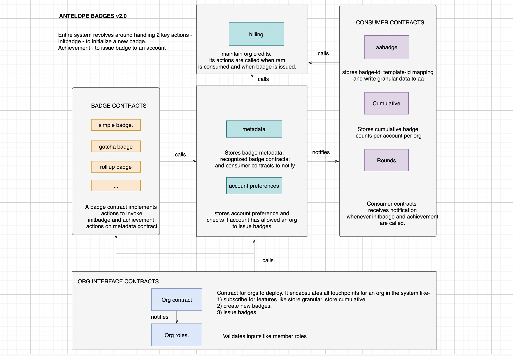

# antelopebadges

## Description
This suite of smart contracts allows creation(as simplebadge and gotchabadge) and consume issuance of these badges (as aabadge, cumulative and rounds). See details about 

Central piece is metadata contract which maintains badge_id, userprefs which maintains user consumption of these badges and billing which maintains counts of credits used by an org.

Suite also provides a sample interface contract that an org can deploy. For implementaion of roles and issunace, sample contract used by Eden community is also provided.

## Architecture Diagram

## Build and deploy
